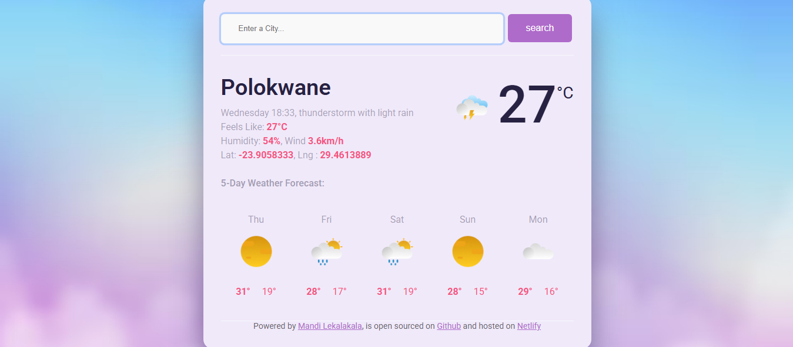
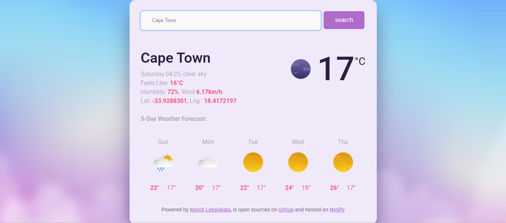
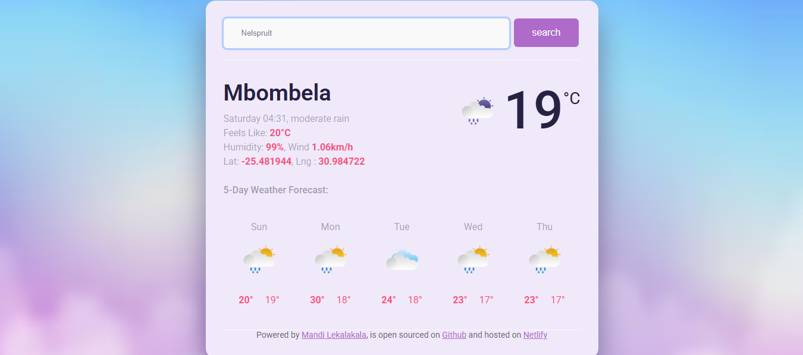

<h2>🌦️ Weather App (Vanilla JavaScript)</h2>

📖 Project Overview:
 
This is a weather application built using vanilla JavaScript, HTML, and CSS. The app allows users to search for a city and view real-time weather information retrieved from an external API, including current conditions and forecasts.
The project focuses on JavaScript fundamentals, API integration, asynchronous data handling, and dynamic updates to the user interface.

🛠️ Technologies Used:
<ul>
<li>HTML/CSS</li>
<li>JavaScript (Vanilla)</li>
<li>External Weather API</li>
</ul>

✨ Key Features:
<ul>
<li>Search weather data by city name</li>
<li>Displays current temperature and weather conditions</li>
<li>Multi-day weather forecast</li>
<li>Anmated weather icons</li>
<li>Shows additional details such as humidity and wind speed</li>
<li>Dynamic DOM updates based on API responses</li>
<li>Asynchronous API calls using fetch / async-await</li>
<li>Responsive, user-friendly interface</li>
</ul>

🧠 What I Learned:
<ul>
<li>Integrating and working with external APIs</li>
<li>Handling asynchronous JavaScript logic</li>
<li>Updating the DOM dynamically based on API data</li>
<li>Structuring JavaScript for clarity and maintainability</li>
<li>Debugging API responses and user input errors</li>
</ul>

  🚀 Live Demo
👉 https://my-vanilla-weatherapp.netlify.app/

 

📌 Notes:
 
This project was built to strengthen front-end development skills and demonstrate practical use of JavaScript, APIs, and responsive UI design.
  

 

📸 Project Preview

  
  
  

